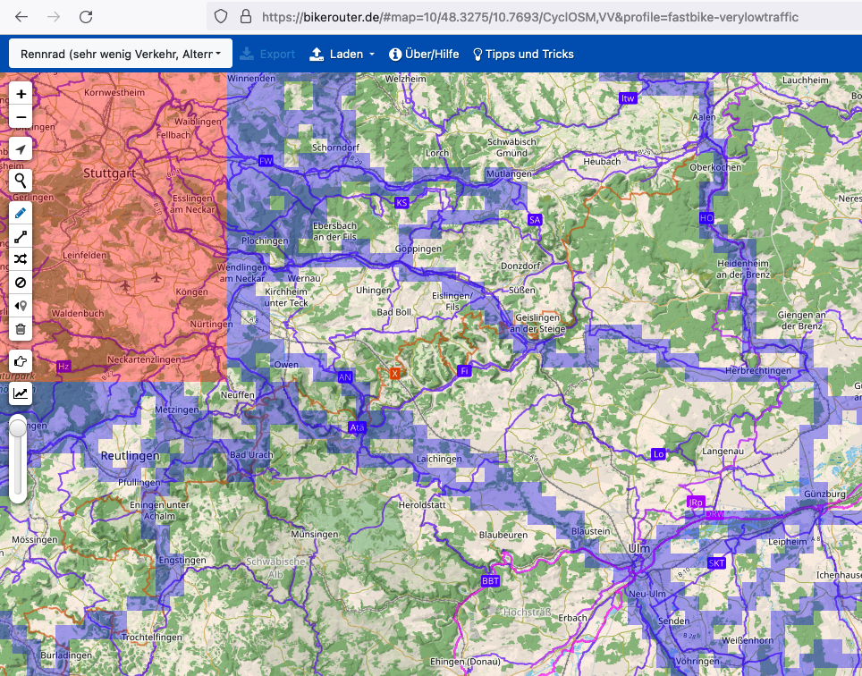

# `kachel`

This project contains a simple webserver that serves veloviewer explorer tiles.
Concretely, it provides an endpoint `/<string:user_id>/<int:z>/<int:x>/<int:y>.png`
that returns a transparent blue tile, if the tile has been covered and a transparent
red tile, if the tile is part of a max square.



## Deployment

```bash
poetry run gunicorn kachel.wsgi:app
```
